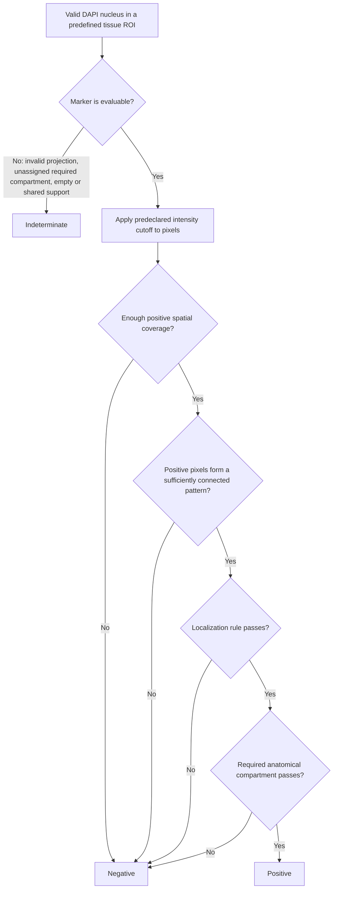

# Marker Morphology and Decision Hierarchy

This document is the authoritative interpretation guide for
`IF_Quant_Pipeline.groovy`. The final marker call is morphology-first. Mean
intensity is retained for audit, but it does not authorize a positive or
negative call.

The numeric values below are conservative pilot defaults. They are not universal
biological cutoffs. Derive intensity cutoffs and confirm morphology parameters
with blinded negative and positive controls, then freeze them before comparing
experimental groups.

## 1. Authoritative decision hierarchy



The hierarchy has three important consequences:

1. A high object mean alone cannot produce a final positive.
2. A low object mean does not force a negative if a thin or localized structure
   has enough connected pixels above the cutoff.
3. Missing spatial information is `indeterminate`, not negative. This prevents
   failed segmentation, ambiguous ownership, or an unassigned compartment from
   silently increasing the negative group.

An image-specific Otsu cutoff is allowed for pilot exploration. Calls using it
are exported as `exploratory_positive` or `exploratory_negative`. A confirmatory
call requires a fixed cutoff declared before analysis from appropriate controls.

## 2. Gate definitions

For a marker-specific support region, the pipeline calculates:

- **Positive fraction:** fraction of support pixels at or above the marker
  cutoff.
- **Largest-component share:** fraction of positive pixels belonging to the
  largest 8-connected component. This rejects scattered bright specks.
- **Localization:** nuclear enrichment for p63/Sox2, nuclear-to-cytoplasmic
  ratio for YAP, or the appropriate perinuclear/apical support for other roles.
- **Ownership:** whether another included nucleus lies inside the same support
  region. Shared support is indeterminate when unique attribution is required.
- **Compartment:** whether a marker restricted to airway or alveolar
  interpretation is being evaluated in the correct anatomical ROI.

The final positive is the logical AND of all applicable morphology gates. A
final negative is allowed only when the marker is evaluable.

## 3. Current pilot defaults

| Marker | Role and support | Minimum positive fraction | Minimum largest-component share | Additional gate |
|---|---|---:|---:|---|
| KRT5 | Perinuclear cytoplasmic ring; independent pod area also reported | 0.20 | 0.50 | Unique ownership |
| AGER | Membrane-support ring | 0.25 | 0.40 | Alveolar ROI; unique ownership |
| PDPN/T1A | Membrane-support ring | 0.25 / 0.30 | 0.40 | Alveolar ROI; unique ownership |
| Pro-SPC | Perinuclear granular cytoplasm | 0.15 | 0.40 | Alveolar ROI; unique ownership |
| CD4/CD8 | Nucleus-associated membrane proxy | 0.20 | 0.40 | Unique ownership |
| Sox2 | DAPI nucleus | 0.40 | 0.60 | Nuclear:ring enrichment at least 1.25 |
| p63 | DAPI nucleus | 0.40 | 0.60 | Nuclear:ring enrichment at least 1.25 |
| YAP | DAPI nucleus plus cytoplasmic reference ring | 0.30 | 0.60 | Nuclear:cytoplasmic ratio at least 1.50; single plane |
| Aqp5 | Perinuclear support | 0.20 | 0.40 | Unique ownership |
| CC10/SCGB1A1 | Perinuclear secretory cytoplasm | 0.20 | 0.40 | Unique ownership |
| tdTomato | Perinuclear reporter support; independent reporter area also reported | 0.20 | 0.40 | Unique ownership |
| Acetylated tubulin | Nucleus-adjacent 6 um apical-cilia support | 0.10 | 0.30 | Airway ROI; unique ownership; regional patches are primary at 20x |
| mRAGE | Membrane-support ring | 0.30 | 0.40 | Alveolar ROI; unique ownership |

The AcTub regional patch filter is 2.0 um2. The previous 0.5 um2 filter was only
about five pixels at the tested 0.311 um/pixel calibration and was too permissive
for a structure-level criterion.

Every value can be overridden without editing the script:

```powershell
$env:IFQ_CC10_THRESHOLD = 'control-derived-value'
$env:IFQ_CC10_MIN_POSITIVE_FRACTION = '0.20'
$env:IFQ_CC10_MIN_LARGEST_COMPONENT_SHARE = '0.40'
$env:IFQ_YAP_MIN_NUC_CYTO_RATIO = '1.50'
$env:IFQ_P63_MIN_NUCLEAR_ENRICHMENT = '1.25'
$env:IFQ_ACTUB_MIN_SUPPORT_FRACTION = '0.10'
$env:IFQ_ACTUB_MIN_PATCH_AREA_UM2 = '2.0'
```

Use `IFQ_<MARKER>_THRESHOLD` for a fixed marker cutoff. Non-alphanumeric marker
characters are removed from the environment token, so `tdTOM` becomes
`IFQ_TDTOM_THRESHOLD` and `mRAGE` becomes `IFQ_MRAGE_THRESHOLD`.

## 4. Marker-specific interpretation

### Nuclear markers: p63 and Sox2

Positive signal must occupy a substantial, connected part of the DAPI nucleus
and be enriched relative to a reference ring. This is stricter than nucleus mean
intensity and rejects isolated nuclear specks and perinuclear blur.

### Nuclear localization marker: YAP

YAP is a localization phenotype, not merely a nuclear-intensity marker. Require
both connected nuclear support and the nuclear:cytoplasmic ratio. Use a single
optical plane or a validated 3D workflow; a maximum projection mixes different
depths and makes the ratio non-local.

### Cytoplasmic and reporter markers

KRT5, Pro-SPC, CC10, and tdTomato use a perinuclear ring because the nucleus
itself is not the expected signal compartment. Connected thresholded coverage is
primary. Whole-marker area remains important for dense KRT5 pods and tdTomato
reporter fields that cannot be represented reliably by one nucleus-centered
measurement per cell.

CC10 denotes current secretory protein phenotype. It does not, by itself, prove
club-cell ancestry after injury. tdTomato denotes recombination history, not
current cell identity.

### Membrane markers

AGER, PDPN/T1A, mRAGE, CD4, and CD8 are membrane-associated. Their signal can be
thin and bright while the mean over a larger ring is low. The positive fraction
and connected-pattern gates are therefore more appropriate than a ring mean.
AGER, PDPN/T1A, and mRAGE require alveolar anatomical context for the specified
AT1 interpretation.

### Acetylated alpha-tubulin

AcTub is concentrated in apical cilia. At 20x, the primary endpoint is regional
ciliary-patch area and component distribution, not an individual-cilium or exact
cell-ownership count. A per-nucleus association is allowed only inside an airway
ROI with unambiguous support ownership. Whole-field or unassigned-compartment
per-cell calls are indeterminate.

## 5. Sectioning rules

### Optical sectioning

- One-plane acquisitions are analyzed as that plane.
- Maximum projection is acceptable for robust area measurements when validated.
- YAP nuclear:cytoplasmic analysis requires a representative single plane or a
  validated 3D method.
- Apical cilia are best assessed in a single apical plane or restricted apical Z
  range when a stack is available.

The tested G002 and G003 Olympus OIR files each contain one optical section, so
no marker-specific Z projection is needed for those two files.

### Anatomical sectioning

Draw ROIs without consulting the target marker channel, then name them:

- `airway`, `airway_01`, or `bronchial_01`;
- `alveoli` or `alveolar_01`;
- `ambiguous` or `ambiguous_01`.

Use `IFQ_COMPARTMENT_MODE=required` for study runs. An unrecognized or ambiguous
required compartment produces indeterminate calls for compartment-dependent
markers.

For a visually reviewed, anatomically homogeneous field only,
`IFQ_WHOLE_FIELD_COMPARTMENT` can record an explicit `airway` or `alveolar`
assignment in provenance. Do not use this override on a mixed field; draw
separate compartment ROIs instead.

### Analytical sectioning

Choose one of: nucleus, perinuclear cytoplasmic ring, membrane-support ring,
independent area mask, apical cilia support, or nuclear:cytoplasmic ratio. These
units are not interchangeable.

## 6. Exported decision fields

The per-cell CSV includes:

- `<marker>_mean` and `<marker>_pos`: legacy mean-intensity audit values;
- `<marker>_support_fraction_above_threshold`;
- `<marker>_largest_positive_component_share`;
- `<marker>_fraction_pass`, `<marker>_connected_pattern_pass`,
  `<marker>_ownership_clear`, `<marker>_enrichment_pass`, and
  `<marker>_compartment_pass`;
- `<marker>_final_call`: `1`, `0`, or blank;
- `<marker>_call_status`: positive, negative, exploratory positive/negative, or
  indeterminate;
- `<marker>_call_reason`;
- `<marker>_true_pos`: compatibility alias for the final call.

The region summary separately reports raw mean-intensity counts, morphology
positive counts, morphology negative counts, indeterminate counts, and evaluable
counts. Classification rules use `<marker>_final_call`, never `<marker>_pos`.

Each marker also receives a morphology-positive nuclei label mask and an
indeterminate nuclei label mask for QC, plus a call-QC PNG with positives in
green, evaluable negatives in cyan, and indeterminate nuclei in magenta.

## 7. One-image-per-panel morphology-primary pilot

The final pilot is a hierarchy test, not a biological endpoint. It used one 20x
G002 field from panel E and one 20x G002 field from panel R:

| Panel/field | Nuclei | Marker morphology + / - / indeterminate | Filtered regional area |
|---|---:|---:|---:|
| E / G002 | 2,909 | CC10 1,431 / 1,340 / 138 | tdTomato 35,371.4 um2 (8.73%) |
| E / G002 | 2,909 | tdTomato 659 / 2,112 / 138 | AcTub 25,171.6 um2 (6.22%) |
| E / G002 | 2,909 | AcTub 0 / 0 / 2,909 | Compartment unassigned |
| R / G002 | 2,108 | T1A 429 / 1,571 / 108 | 29,792.5 um2 (7.36%) |
| R / G002 | 2,108 | tdTomato 1,183 / 817 / 108 | 73,498.7 um2 (18.15%) |
| R / G002 | 2,108 | mRAGE 113 / 1,887 / 108 | 12,203.2 um2 (3.01%) |

All calls and areas are exploratory because the pilot used image-specific Otsu
thresholds. The mixed panel-E field was not forced to `airway`, so all AcTub
per-cell calls are indeterminate. The inspected panel-R field was homogeneous
alveolar parenchyma and used a provenance-recorded whole-field `alveolar`
assignment. See `PILOT_G002_MORPHOLOGY_RESULTS.md` for full results.

## 8. QC and control acceptance

Before accepting a field, verify:

- channel order and calibration;
- DAPI split/merge quality and rejected candidates;
- threshold boundaries follow the intended structure;
- connected-support gates reject isolated bright specks;
- shared support is not forced to a cell;
- airway/alveolar/ambiguous labels are defensible;
- no blank final call was converted to zero;
- fixed thresholds and morphology parameters were frozen before group analysis;
- biological replication is aggregated at mouse level, not section or field.

## 9. Literature basis

- YAP activity is associated with nuclear localization rather than total signal:
  [PMC5360446](https://pmc.ncbi.nlm.nih.gov/articles/PMC5360446/).
- Acetylated tubulin is used to identify ciliated airway cells:
  [PMC3604083](https://pmc.ncbi.nlm.nih.gov/articles/PMC3604083/).
- Airway epithelial marker organization includes CC10 and apical cilia:
  [PMC11212965](https://pmc.ncbi.nlm.nih.gov/articles/PMC11212965/).
- Podoplanin is a thin cell-surface marker and RAGE/PDPN mark AT1 phenotypes:
  [PMC2542444](https://pmc.ncbi.nlm.nih.gov/articles/PMC2542444/),
  [PMC8480975](https://pmc.ncbi.nlm.nih.gov/articles/PMC8480975/).
- KRT5-positive injury-associated pods and lineage interpretation:
  [PMC5906746](https://pmc.ncbi.nlm.nih.gov/articles/PMC5906746/),
  [PMC4312207](https://pmc.ncbi.nlm.nih.gov/articles/PMC4312207/).

## 10. Related files

- `IF_Quant_Pipeline.groovy`: implementation and parameter provenance.
- `README.md`: installation, execution, outputs, and statistics.
- `aggregate_to_mouse.py`: mouse-level aggregation after section QC.
