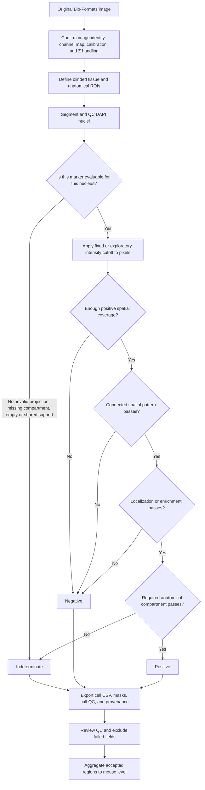

# Active Quantification and Marker Morphology Workflow

This is the primary operational and interpretation reference for the current
morphology-first Fiji/ImageJ pipeline. Final marker calls are determined by
role-appropriate spatial morphology. Mean intensity is retained for audit, but
it does not authorize a positive or negative call.

The numeric morphology settings below are conservative pilot defaults, not
universal biological cutoffs. Derive intensity cutoffs and validate morphology
parameters using blinded negative and positive controls, then freeze them before
comparing experimental groups.

## Active entry points

- [`IF_Quant_Pipeline.groovy`](IF_Quant_Pipeline.groovy): production
  Fiji/ImageJ analysis.
- [`aggregate_to_mouse.py`](aggregate_to_mouse.py): region-to-mouse aggregation.
- [`samplesheet_template.csv`](samplesheet_template.csv): metadata template.
- [`README.md`](README.md): installation, panel definitions, configuration, and
  output schema.
- [`docs/MARKER_MORPHOLOGY_GUIDE.md`](docs/MARKER_MORPHOLOGY_GUIDE.md): extended
  morphology and literature notes.
- [`docs/UNIVERSAL_MARKER_CONFIGURATION.md`](docs/UNIVERSAL_MARKER_CONFIGURATION.md):
  reusable marker, disease-context, panel, and ROI-tag hierarchy.
- [`config/lung_marker_registry.json`](config/lung_marker_registry.json): marker
  aliases, localization, lineage/state notes, and analytical-role defaults.
- [`config/custom_panels.example.json`](config/custom_panels.example.json):
  opt-in study panel templates; built-in panels remain unchanged.
- [`docs/PILOT_G002_MORPHOLOGY_RESULTS.md`](docs/PILOT_G002_MORPHOLOGY_RESULTS.md):
  validated one-image pilots.

## Universal marker-selection hierarchy

Before analyzing a new marker set, freeze these layers in order:

1. Research question and biological unit: lineage, transient state,
   localization, regional burden, or spatial relationship.
2. Species, preparation, modality, antibody clone, and known controls.
3. Blinded anatomical/context ROIs.
4. A lineage anchor, state marker, and nearest-alternative/exclusion marker.
5. Analytical role: nuclear, nuclear ratio, cytoplasmic, membrane, apical
   cilia, or regional area.
6. Channel map and projection policy for the actual acquisition.
7. Control-derived intensity cutoff and validated morphology/size gates.

Marker identity, image channel, analytical geometry, and biological
interpretation are separate. A marker registry entry may supply a geometry
default, but it never assigns a disease diagnosis or a final cell identity.
Unknown markers remain supported when the custom panel declares their role.

For the newly expanded profiles: KRT8 uses connected cytoplasmic filament
support; ITGA2/CD49b uses connected membrane support; SOX9 requires connected
DAPI-nuclear enrichment; and PDGFRB is preferably a regional/perivascular area
endpoint at 20x, with per-nucleus membrane calls reserved for validated
high-resolution ownership. Red2-Kras uses connected cytoplasmic RFP reporter
support with clone area primary at 20x; RFP-positive marks the verified
oncogene-coupled clone, whereas RFP-negative alone is not a wild-type call.
Pan-KRAS uses connected cytoplasmic/inner-membrane protein support but does not
imply a KRAS mutation. Ki-67/MKI67 uses connected nuclear enrichment and is
summarized as a labeling index inside a predeclared population or ROI. `IGTA2`
is accepted as an alias of canonical `ITGA2`. Except for the construct-linked
Red2-Kras RFP interpretation, none of these markers assigns a lineage,
mutation, malignancy, or disease state by itself.

## End-to-end workflow



## Decision authority and three-state semantics

The authoritative cell call is `<marker>_final_call`:

- `1`: morphology-positive;
- `0`: evaluable morphology-negative;
- blank: indeterminate because the marker could not be evaluated safely.

Classification and summary endpoints consume this field. The legacy object-mean
field `<marker>_pos` is audit-only.

This hierarchy has three important consequences:

1. A high object mean alone cannot produce a final positive.
2. A low object mean does not force a negative when a thin or localized
   structure has sufficient connected pixels above the cutoff.
3. Missing spatial information is indeterminate, not negative. Segmentation
   failure, ambiguous ownership, invalid projection, or an unassigned required
   compartment must not silently inflate the negative group.

Adaptive Otsu thresholds are allowed for pilot exploration and produce
`exploratory_positive` or `exploratory_negative` status. Confirmatory analysis
requires a fixed cutoff declared from appropriate controls before analysis.

## Morphology gate definitions

For each marker-specific support region, the pipeline calculates:

- **Positive fraction:** fraction of support pixels at or above the resolved
  marker cutoff.
- **Largest-component share:** fraction of positive pixels belonging to the
  largest 8-connected component. This rejects scattered bright specks.
- **Localization:** nuclear enrichment for p63/Sox2, nuclear-to-cytoplasmic ratio
  for YAP, or the appropriate perinuclear/apical support for other roles.
- **Ownership:** whether another included nucleus lies inside support that is
  meant to belong uniquely to the current cell. Shared support is indeterminate.
- **Compartment/context:** whether the marker is evaluated in a compatible
  airway, alveolar, tumor, fibrotic, stromal, vascular, or immune ROI. Multiple
  tags can coexist in one ROI name.

A final positive is the logical AND of all applicable gates. A final negative is
allowed only when the marker is evaluable.

## Current pilot morphology matrix

| Marker | Expected role and analytical support | Minimum positive fraction | Minimum largest-component share | Additional gate or primary readout |
|---|---|---:|---:|---|
| KRT5 | Perinuclear cytoplasmic ring | 0.20 | 0.50 | Unique ownership; independent pod area is also reported |
| AGER | Membrane-support ring | 0.25 | 0.40 | Alveolar ROI; unique ownership; membrane area also reported |
| PDPN | Membrane-support ring | 0.25 | 0.40 | Alveolar ROI; unique ownership; membrane area also reported |
| T1A | Membrane-support ring | 0.30 | 0.40 | Alveolar ROI; unique ownership; membrane area also reported |
| mRAGE | Membrane-support ring | 0.30 | 0.40 | Alveolar ROI; unique ownership; membrane area also reported |
| Pro-SPC | Perinuclear granular cytoplasm | 0.15 | 0.40 | Alveolar ROI; unique ownership |
| CD4/CD8 | Nucleus-associated membrane proxy | 0.20 | 0.40 | Unique ownership |
| Sox2 | DAPI nucleus | 0.40 | 0.60 | Nuclear:ring enrichment at least 1.25 |
| p63 | DAPI nucleus | 0.40 | 0.60 | Nuclear:ring enrichment at least 1.25 |
| YAP | DAPI nucleus plus cytoplasmic reference ring | 0.30 | 0.60 | Nuclear:cytoplasmic ratio at least 1.50; single plane |
| Aqp5 | Perinuclear support | 0.20 | 0.40 | Unique ownership |
| CC10/SCGB1A1 | Perinuclear secretory cytoplasm | 0.20 | 0.40 | Unique ownership |
| tdTomato | Perinuclear reporter support | 0.20 | 0.40 | Unique ownership; independent reporter area also reported |
| Acetylated tubulin | Nucleus-adjacent 6 um ciliary support | 0.10 | 0.30 | Airway ROI; unique ownership; regional ciliary patches are primary at 20x |

The AcTub regional patch filter is 2.0 um2. The former 0.5 um2 filter was only
about five pixels at the tested 0.311 um/pixel calibration and was too permissive
for a structure-level endpoint.

## Marker-specific interpretation

### Nuclear markers: p63 and Sox2

Positive signal must occupy a substantial connected portion of the DAPI nucleus
and be enriched relative to the reference ring. This rejects isolated nuclear
specks and perinuclear blur that could raise a nucleus mean.

### Nuclear localization marker: YAP

YAP is a localization phenotype, not merely a nuclear-intensity marker. Require
both connected nuclear support and the nuclear:cytoplasmic ratio. Use a single
optical plane or a validated 3D workflow; maximum projection mixes different
depths and makes the ratio non-local.

### Cytoplasmic and reporter markers

KRT5, Pro-SPC, CC10, and tdTomato use a perinuclear ring because the nucleus is
not the expected signal compartment. Connected thresholded coverage is primary.
Whole-marker area remains important for dense KRT5 pods and tdTomato reporter
fields that cannot be represented reliably by one nucleus-centered measurement
per cell.

CC10 denotes current secretory protein phenotype; it does not prove club-cell
ancestry after injury. tdTomato denotes recombination history, not current cell
identity.

### Membrane markers

AGER, PDPN/T1A, mRAGE, CD4, and CD8 are membrane-associated. Their signal can be
thin and bright while the mean over a larger ring is low. Positive fraction and
connected-pattern gates are therefore more appropriate than ring mean alone.
AGER, PDPN/T1A, and mRAGE require alveolar anatomical context for the specified
AT1 interpretation. Regional membrane area and cell-associated calls answer
different questions and must be reported separately.

### Acetylated alpha-tubulin

AcTub is concentrated in apical cilia. At 20x, the primary endpoint is regional
ciliary-patch area and component distribution, not an individual-cilium or exact
cell-ownership count. A per-nucleus association is allowed only inside an airway
ROI with unambiguous support ownership. Whole-field or unassigned-compartment
per-cell calls are indeterminate.

## Sectioning rules

### Optical sectioning

- One-plane acquisitions are analyzed as that plane.
- Maximum projection is acceptable for robust area measurements when validated.
- YAP nuclear:cytoplasmic analysis requires a representative single plane or a
  validated 3D method.
- Apical cilia are best assessed in a single apical plane or restricted apical Z
  range when a stack is available.

The tested G002 and G003 Olympus OIR files each contain one optical section, so
no marker-specific Z projection is needed for those files.

### Anatomical sectioning

Draw ROIs without consulting the target marker channel, then use recognizable
names:

- `airway`, `airway_01`, or `bronchial_01`;
- `alveoli` or `alveolar_01`;
- `tumor_01` or `luad_01`;
- `alveolar_fibrotic_01`, `honeycomb_01`, or `uip_01`;
- `stromal_01`, `vascular_01`, or `immune_01`;
- `ambiguous` or `ambiguous_01`.

The pipeline exports all recognized labels as `region_tags`, while
`compartment` remains a single backward-compatible primary label. A panel can
accept any of several tags through `expectedCompartments`.

For study runs:

```powershell
$env:IFQ_COMPARTMENT_MODE = 'required'
```

An unrecognized or ambiguous required compartment produces indeterminate calls
for compartment-dependent markers.

For a visually reviewed, anatomically homogeneous field only,
`IFQ_WHOLE_FIELD_COMPARTMENT` can record an explicit `airway` or `alveolar`
assignment in provenance. Never force a mixed field into one compartment; draw
separate ROIs instead.

### Analytical sectioning

Choose the unit that matches the biology: nucleus, perinuclear cytoplasmic ring,
membrane-support ring, independent positive-area mask, apical-cilia support, or
nuclear:cytoplasmic ratio. These units are not interchangeable.

## Threshold and control policy

- Use unstained, secondary-only, or biological negative controls to estimate
  background and nonspecific signal.
- Use known positive tissue to verify that the threshold captures the expected
  structure rather than merely the brightest pixels.
- Derive fixed thresholds without consulting experimental group outcomes.
- Freeze threshold, minimum positive fraction, connectedness, minimum area,
  support width, projection, DAPI segmentation, and compartment rules before a
  cohort run.
- Keep all resolved parameters in `__params.json` and `run_manifest.json`.

Marker-specific overrides follow these patterns:

```powershell
$env:IFQ_CC10_THRESHOLD = 'control-derived-value'
$env:IFQ_CC10_MIN_POSITIVE_FRACTION = '0.20'
$env:IFQ_CC10_MIN_LARGEST_COMPONENT_SHARE = '0.40'
$env:IFQ_YAP_MIN_NUC_CYTO_RATIO = '1.50'
$env:IFQ_P63_MIN_NUCLEAR_ENRICHMENT = '1.25'
$env:IFQ_ACTUB_MIN_SUPPORT_FRACTION = '0.10'
$env:IFQ_ACTUB_MIN_PATCH_AREA_UM2 = '2.0'
```

Use `IFQ_<MARKER>_THRESHOLD` for a fixed cutoff. Non-alphanumeric characters are
removed from the environment token: `tdTOM` becomes `IFQ_TDTOM_THRESHOLD` and
`mRAGE` becomes `IFQ_MRAGE_THRESHOLD`.

## Minimal Fiji batch configuration

```powershell
$env:IFQ_INPUT_DIR = 'G:\path\to\originals'
$env:IFQ_OUTPUT_DIR = "$PWD\analysis_output\run_name"
$env:IFQ_PANEL = 'E'
$env:IFQ_SEGMENTER = 'classic'
$env:IFQ_PROJECTION = 'max'
$env:IFQ_MARKER_REGISTRY = "$PWD\config\lung_marker_registry.json"
# For a new study: $env:IFQ_PANEL_CONFIG = 'D:\study\panels.json'
$env:IFQ_INCLUDE_REGEX = '.*A01_G002_0001.*'
$env:IFQ_MAX_IMAGES = '1'
$env:IFQ_MORPHOLOGY_PRIMARY = 'true'
```

Use a new, empty output directory for every run. A batch with no matching
images exits with code 1. Per-image failures are retained in `run_manifest.json`
and make the final manifest status `partial_failure` or `failed`; headless Fiji
also exits with code 1 after preserving the partial summary.

Run `IF_Quant_Pipeline.groovy` headlessly or through Fiji's Groovy script editor.
Every run must retain `run_manifest.json`, per-image `__params.json`, cell CSVs,
region summaries, decision masks, and call-QC PNGs.

## Exported decision fields

The per-cell CSV includes:

- `<marker>_mean` and `<marker>_pos`: legacy mean-intensity audit values;
- `<marker>_support_fraction_above_threshold`;
- `<marker>_largest_positive_component_share`;
- `<marker>_fraction_pass`, `<marker>_connected_pattern_pass`,
  `<marker>_ownership_clear`, `<marker>_enrichment_pass`, and
  `<marker>_compartment_pass`;
- `<marker>_final_call`: `1`, `0`, or blank;
- `<marker>_call_status` and `<marker>_call_reason`;
- `<marker>_true_pos`: compatibility alias for the final call.

The region summary separately reports raw mean-intensity, morphology-positive,
morphology-negative, indeterminate, and evaluable counts. It also exports:

- nucleus-candidate acceptance and rejection fractions, with rejection reasons;
- marker positive/negative fractions among evaluable cells;
- marker indeterminate fractions among included nuclei;
- raw-intensity-positive/final-negative and
  raw-intensity-negative/final-positive disagreement counts;
- an intensity-morphology discordance fraction and a review-burden proxy
  (`indeterminate + discordant`) for longitudinal script QC.

These audit fractions are sensitivity and review-burden proxies, not validated
false-positive or false-negative rates. Classification rules use
`<marker>_final_call`, never `<marker>_pos`.

Every marker receives morphology-positive and indeterminate nuclei label masks,
plus a call-QC PNG with positive nuclei in green, evaluable negatives in cyan,
indeterminate nuclei in magenta, and the analysis ROI in orange.

## QC acceptance order

1. Confirm image identity, channel order, calibration, and projection.
2. Review DAPI candidate, accepted, rejected, split, and merged objects.
3. Confirm threshold boundaries follow the intended marker structure.
4. Confirm connected-support gates reject isolated bright specks.
5. Review call-QC images and verify spatially plausible positives.
6. Confirm shared support is not forced to a cell.
7. Confirm airway, alveolar, and ambiguous ROI labels are defensible.
8. Confirm no blank final call was converted to zero.
9. Freeze thresholds and morphology parameters before blinded group analysis.

## Statistical unit

Run:

```powershell
uv run --no-project python aggregate_to_mouse.py analysis_output\run_name\run_summary.csv
```

All inferential statistics use mouse-level rows. Sections, fields, regions, and
nuclei are not independent biological replicates.

## Current validation outputs

The two final local pilots are under `test_runs/current/`:

- `FinalPilot_CC10_AcTub_G002_morphology_primary_v2`;
- `FinalPilot_T1A_mRAGE_G002_morphology_primary_v2`.

These outputs are intentionally ignored by Git because they contain generated
images and tables. Their numerical results are preserved in
[`docs/PILOT_G002_MORPHOLOGY_RESULTS.md`](docs/PILOT_G002_MORPHOLOGY_RESULTS.md).
All reported calls and areas remain exploratory because the pilot used
image-specific Otsu thresholds.

## Literature basis

- YAP activity and nuclear localization:
  [PMC5360446](https://pmc.ncbi.nlm.nih.gov/articles/PMC5360446/).
- Acetylated tubulin as a ciliated-airway-cell marker:
  [PMC3604083](https://pmc.ncbi.nlm.nih.gov/articles/PMC3604083/).
- CC10 and apical-cilia organization in airway epithelium:
  [PMC11212965](https://pmc.ncbi.nlm.nih.gov/articles/PMC11212965/).
- Podoplanin/RAGE and AT1 phenotypes:
  [PMC2542444](https://pmc.ncbi.nlm.nih.gov/articles/PMC2542444/),
  [PMC8480975](https://pmc.ncbi.nlm.nih.gov/articles/PMC8480975/).
- KRT5-positive injury pods and lineage interpretation:
  [PMC5906746](https://pmc.ncbi.nlm.nih.gov/articles/PMC5906746/),
  [PMC4312207](https://pmc.ncbi.nlm.nih.gov/articles/PMC4312207/).

## Legacy boundary

[`legacy/`](legacy/README.md) is non-authoritative. Do not copy thresholds or
call semantics from that archive into a new study run. The pre-organization
repository is also preserved at branch `codex/legacy-pre-reorganization`.
