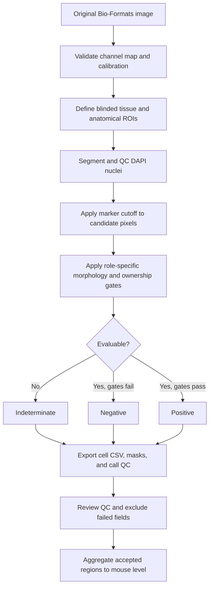

# Active Quantification Workflow

This file is the short operational index for the current morphology-primary
pipeline. Detailed biological rationale is in
`docs/MARKER_MORPHOLOGY_GUIDE.md`.

## Active entry points

- `IF_Quant_Pipeline.groovy`: production Fiji/ImageJ analysis.
- `aggregate_to_mouse.py`: region-to-mouse aggregation.
- `samplesheet_template.csv`: metadata template.
- `README.md`: installation, panels, configuration, and output schema.
- `docs/PILOT_G002_MORPHOLOGY_RESULTS.md`: latest validated one-image pilots.

## End-to-end sequence



## Marker decision authority

The final call is `<marker>_final_call`: `1`, `0`, or blank. Classification and
summary endpoints consume this morphology-authoritative field. The legacy object
mean field `<marker>_pos` is retained only for audit.

Confirmatory analysis requires fixed, control-derived intensity cutoffs.
Adaptive Otsu calls are labeled exploratory even when morphology gates pass.

## Anatomical sectioning

Prefer manual ROIs named `airway`, `alveoli`, or `ambiguous`, drawn without
consulting the target marker channel. Use:

```powershell
$env:IFQ_COMPARTMENT_MODE = 'required'
```

`IFQ_WHOLE_FIELD_COMPARTMENT` is allowed only for an anatomically homogeneous,
visually reviewed field. Mixed airway/alveolar fields require separate ROIs.

## Minimal Fiji batch configuration

```powershell
$env:IFQ_INPUT_DIR = 'G:\path\to\originals'
$env:IFQ_OUTPUT_DIR = "$PWD\analysis_output\run_name"
$env:IFQ_PANEL = 'E'
$env:IFQ_INCLUDE_REGEX = '.*A01_G002_0001.*'
$env:IFQ_MAX_IMAGES = '1'
$env:IFQ_MORPHOLOGY_PRIMARY = 'true'
```

Run `IF_Quant_Pipeline.groovy` headlessly or through Fiji's Groovy script editor.
Every run must retain `run_manifest.json`, per-image `__params.json`, cell CSVs,
region summaries, decision masks, and call-QC PNGs.

## QC acceptance order

1. Confirm image identity, channel order, calibration, and projection.
2. Review DAPI candidate, accepted, rejected, split, and merged objects.
3. Confirm threshold boundaries follow the intended marker structure.
4. Review marker call-QC images: positive green, negative cyan, indeterminate
   magenta, ROI orange.
5. Confirm compartment and ownership failures remain indeterminate.
6. Freeze parameters before processing blinded study groups.

## Statistical unit

Run:

```powershell
uv run --no-project python aggregate_to_mouse.py analysis_output\run_name\run_summary.csv
```

All inferential statistics use mouse-level rows. Sections, fields, regions, and
nuclei are not independent biological replicates.

## Current validation outputs

The two final local pilots are under `test_runs/current/`:

- `FinalPilot_CC10_AcTub_G002_morphology_primary_v2`
- `FinalPilot_T1A_mRAGE_G002_morphology_primary_v2`

These outputs are intentionally ignored by Git because they contain generated
images and tables. Their numerical results are preserved in
`docs/PILOT_G002_MORPHOLOGY_RESULTS.md`.

## Legacy boundary

`legacy/` is non-authoritative. Do not copy thresholds or call semantics from
that archive into a new study run. The pre-reorganization repository is also
preserved at branch `codex/legacy-pre-reorganization`.
